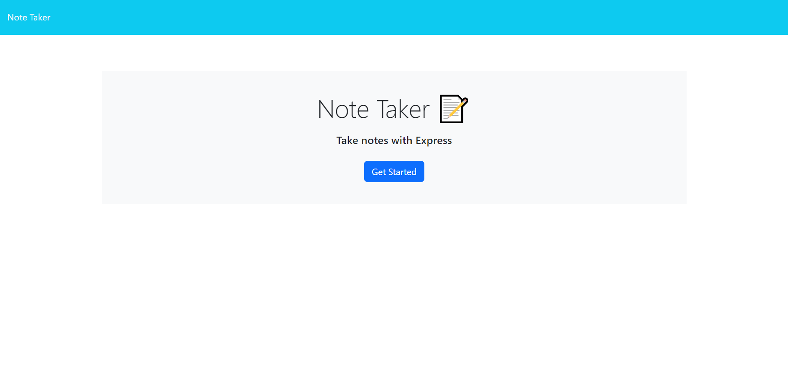
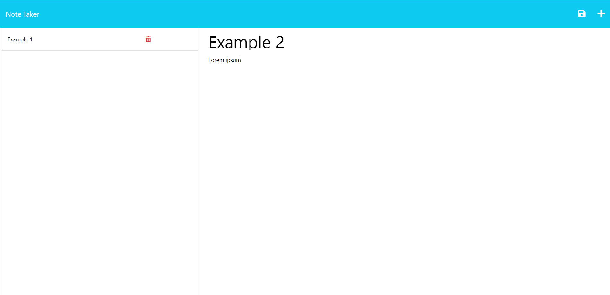

# Note Taker 

## Description
Application called Note Taker that can be used to write and save notes. This application will use an Express.js back end and will save and retrieve note data from a JSON file as database.

Deployed application URL: https://note-taker-ch-11.herokuapp.com/

Landing Page Screenshot:

Notes page Screenshot:

## Installation
N/A

## Local Usage
Just download the code or clone it to your local folder and type "npm start" into your terminal in the develop folder route to start the Note Taker app.

Now open the app in http://localhost:3001/ for starting writing notes.

## Credits
N/A

## License
N/A